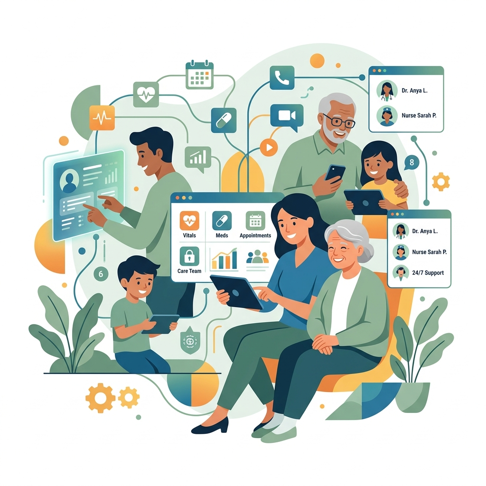
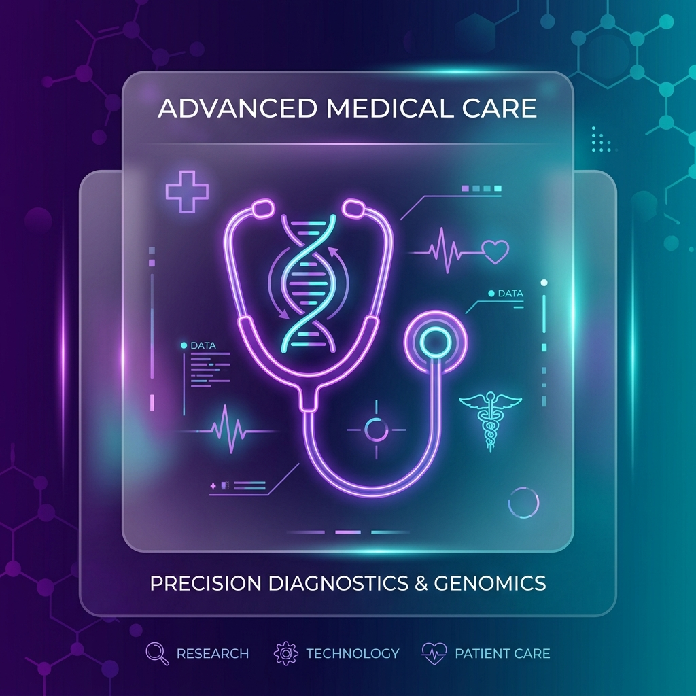

# CareOne 🩺
### Clinical-Grade Multi-Agent Care Coordination & Longitudinal Analytics
*Kaggle AI Agents Capstone Project — "Agents for Good" (Healthcare/Caregiving) Track*

CareOne is a clinical-grade care coordination platform that uses a multi-agent system to turn messy, natural-language caregiver notes into structured timelines, vital audits, safety risk assessments, and shift handoffs.

---

## 1. Project Overview

Caregiving is often chaotic, with critical patient details scattered across text messages, paper logs, and verbal reports. CareOne solves this by serving as an intelligent, automated eldercare EMR and coordination hub.

It orchestrates a specialized **8-Agent Pipeline** powered by `gemini-2.5-flash` to parse shift notes, extract encrypted vitals, audit safety compliance, cross-reference scheduled routines, and compile structured daily clinical handoffs.

---

## 2. Core Features

* 🩺 **8-Agent Clinical Orchestration**: Employs Pydantic structured output schemas via the Google GenAI SDK to cascade clinical reasoning and metrics down a pipeline of specialized agents (Parser, Vitals, Reconciler, Refusal, Gaps, Risk, Trends, Summary).
* 🔒 **PHI Symmetrical Encryption**: Symmetrically encrypts all patient notes, vitals, and logs at rest using AES-based Fernet cryptography (`cryptography.fernet`) to guarantee HIPAA compliance.
* 📈 **Longitudinal Analytics**: Renders interactive SVG-based charts tracking patient wellness indicators (Routine Adherence, BP trends, Heart Rate, Fluid Intake, Medication Adherence, and computed Safety Risk Index).
* 📱 **Fluid Responsiveness**: Premium glassmorphism design fully optimized for all viewports (from 1920px Desktop down to 320px mobile screens) with no overflow.
* 🔑 **Full Auth Suite & Reset**: Secure registration, login, logout, and password reset syncing live to MongoDB Atlas.
* 📁 **Clinical Handoff Exports**: Instantly compiles patient logs and shift records into printable PDFs and styled Microsoft Word document reports (`.doc`).
* ⚙️ **Robust DB Fallback**: Seamlessly connects to MongoDB Atlas with an automated local JSON fallback when offline.

---

## 3. Architecture & Data Flow Diagram

```
                        ┌─────────────────────────────────┐
                        │      FastAPI Studio Dashboard   │
                        │      (Port 8501 SaaS UI)        │
                        └────────────────┬────────────────┘
                                         │
                                         ▼
                        ┌─────────────────────────────────┐
                        │    Multi-Agent Pipeline         │
                        │    (Orchestrated via Pydantic)  │
                        └────────┬────────────────────────┘
                                 │
         ┌───────────────────────┼────────────────────────┐
         │                       │                        │
         ▼                       ▼                        ▼
┌──────────────────┐   ┌──────────────────┐   ┌──────────────────┐
│   Parser Agent   │   │   Vitals Agent   │   │Reconciliation Agt│
│  (Entity Ext.)   │   │  (Vital Mapping) │   │ (Event Reconcile)│
└──────────────────┘   └──────────────────┘   └──────────────────┘
         │                       │                        │
         ▼                       ▼                        ▼
┌──────────────────┐   ┌──────────────────┐   ┌──────────────────┐
│  Refusal Agent   │   │   Gaps Agent     │   │   Risk Agent     │
│ (Safety Inter.)  │   │  (Schedule Aud.) │   │  (Safety Index)  │
└──────────────────┘   └──────────────────┘   └──────────────────┘
         │                       │                        │
         ▼                       ▼                        ▼
┌──────────────────┐   ┌──────────────────┐   ┌──────────────────┐
│   Trends Agent   │   │  Summary Agent   │   │  Memory & Profile│
│  (7-day Trends)  │   │(Shift Narrative) │   │ (HIPAA Encrypted)│
└──────────────────┘   └──────────────────┘   └──────────────────┘
                                                           │
                                                           ▼
                                              ┌──────────────────┐
                                              │ MongoDB / JSON   │
                                              │ (Encrypted PHI)  │
                                              └──────────────────┘
```

---

## 4. Tech Stack

* **Frontend**: HTML5, Vanilla CSS3 (Custom Variables, glassmorphism, responsive media viewports), ES6 JavaScript (Client-side routing, SVG graphing).
* **Backend**: FastAPI, Gradio (interactive sandbox console), Pydantic (data structures validation).
* **Database**: MongoDB Atlas, local JSON fallback engine.
* **AI Engine**: Google GenAI SDK (`gemini-2.5-flash`).
* **Security & Formatting**: `cryptography.fernet`, `fpdf2`.

---

## 5. Screenshots

### Platform Landing Hub


### Sign In & Authentication


---

## 6. Setup & Installation

### 1. Prerequisite
Ensure you have Python 3.10+ installed.

### 2. Install Packages
```bash
# Clone the repository
git clone https://github.com/your-username/careone.git
cd careone

# Create and activate virtual environment
python -m venv .venv
source .venv/bin/activate  # On Windows: .venv\Scripts\activate

# Install requirements
pip install -r requirements.txt
```

### 3. Environment Variables
Create a `.env` file in your root directory:
```env
# 1. Google Gemini configuration
GEMINI_API_KEY="your-api-key-here"

# 2. Database configuration
MONGO_URI="mongodb+srv://<db_user>:<db_password>@cluster.xxxxxx.mongodb.net/CareOne?retryWrites=true&w=majority"
MONGO_DB_NAME="CareOne"

# 3. Model configurations
CAREONE_LIVE_LLM=1 # Set to 1 for live Gemini models, 0 for fast local mock responses
```

---

## 7. Running the Platform

### Launch SaaS Studio (Recommended)
```bash
python web_app.py
```
*Access the platform dashboard at:* **`http://127.0.0.1:8501`**

### Launch Gradio Playback Sandbox
```bash
python app.py
```
*Access the sandbox console at:* **`http://localhost:7860`**

### Run Unit & Integration Tests
```bash
python -m unittest test_pipeline.py
```

---

## 8. Future Roadmap

* 💬 **AI SMS & WhatsApp Alerts**: Connect immediate gap alerts to Twilio or WhatsApp Business APIs to notify caregivers instantly on their mobile phones.
* 🎙️ **Clinical Speech Transcription**: Enable voice-note transcription directly inside the caregiver input form using Gemini's audio-understanding capabilities.
* 🔄 **HL7 / FHIR Integration**: Enable seamless sync with existing clinical EHR systems (Epic, Cerner) using standardized health records protocols.
* 📡 **Offline-First Synchronization**: Build service workers that allow offline local cache modification when internet connections fail, syncing to Atlas automatically once re-established.
